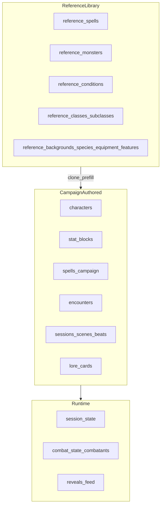

# Target architecture — reference library, campaign entities, runtime

This document defines the intended separation of concerns for the DB-first platform evolution (Stages 2–7). It complements [`stage-1-audit.md`](./stage-1-audit.md).

---

## 1. Three layers

### Reference library (canonical SRD / OGL data)

- **Source of truth:** Postgres tables dedicated to imported reference rows (recommended prefix `reference_*` or a single `library_source` discriminator), **not** live HTTP to dnd5eapi.co at runtime.
- **Origin:** JSON packs under [`docs/5e-database-main/src/2014`](../../docs/5e-database-main/src/2014) and [`2024`](../../docs/5e-database-main/src/2024) (MIT + OGL content).
- **Mutability:** Treat as versioned/immutable per import batch; corrections ship as re-import or patch rows, not DM edits in-place (optional `reference_overrides` table later if needed).
- **Consumers:** DM browser/search, “clone to campaign”, spell/stat prefill, PDF import matching, future character creator prefills.
- **Combat/runtime:** Must **not** read reference tables directly. Runtime uses **campaign** copies (stat blocks, spells linked to characters).

### Campaign-authored entities (editable per campaign)

- **Examples:** `characters`, `stat_blocks` (campaign rows), `spells` (homebrew / campaign overrides), `encounters`, `sessions` / scenes / beats, `lore_cards`, `npcs`, etc. (see [`supabase/schema.sql`](../../supabase/schema.sql)).
- **Source of truth:** Supabase rows scoped by `campaign_id` (or explicit global campaign for shared homebrew if you introduce it).
- **Provenance:** Optional columns: `cloned_from_reference_id`, `source_index`, `ruleset` for traceability.

### Runtime / session state (transient or session-scoped)

- **Examples:** `session_state` (e.g. `active_session_uuid`), combat documents in DB, `reveals`, realtime feeds, client Zustand mirrors.
- **Rule:** Derived from campaign + live play; safe to reset or resync from campaign truth when inconsistent.

---

## 2. Spells: unique constraint and split

**Today:** [`spells`](../../supabase/schema.sql) uses a **global unique** index on `spell_id`, while `campaign_id` can be null (compendium) or set. That blocks two different campaign spells sharing the same `spell_id`, and blurs “reference” vs “campaign”.

**Recommended direction (Stage 3):**

1. Add **`reference_spells`** (or equivalent) with stable `index` / `spell_id` from SRD JSON, `ruleset`, and full text fields. No `campaign_id`.
2. Keep **`spells`** for **campaign + global homebrew** with unique constraint **`(campaign_id, spell_id)`** (nullable campaign handled with partial unique index or surrogate campaign for “platform global homebrew”).
3. Migrate existing `campaign_id is null` rows into `reference_spells` or mark them as reference with a migration script.
4. Drop or replace `spells_spell_id_unique` after data migration.

Until then, ETL can still load reference data into a **separate table** without touching the unique constraint on `spells`.

---

## 3. Creatures / stat blocks

**Today:** [`stat_blocks`](../../supabase/schema.sql) are campaign-scoped; static [`STAT_BLOCKS`](../../shared/content/statblocks.js) fills gaps in UI.

**Target:**

- **`reference_monsters`** (or `reference_stat_blocks`) populated from `5e-SRD-Monsters.json` (+ 2024 equivalent).
- **Campaign `stat_blocks`:** created by “Clone from reference”, encounter authoring, or PDF/import pipelines; optional `source_index` / `cloned_from_reference_id`.
- **Retire** runtime reads of `STAT_BLOCKS` once DB + reference clone exist.

---

## 4. ETL source map (initial)

| Reference entity | Suggested JSON source (2014) | Notes |
|------------------|-------------------------------|-------|
| Spells | `5e-SRD-Spells.json` | Large; map to normalized spell shape |
| Monsters | `5e-SRD-Monsters.json` | Map to reference stat block row + actions JSON |
| Conditions | `5e-SRD-Conditions.json` | Small; good first slice |
| Classes / levels | `5e-SRD-Classes.json`, `5e-SRD-Levels.json` | For future character creator |
| Subclasses | `5e-SRD-Subclasses.json` | |
| Races / species | `5e-SRD-Races.json` / 2024 `5e-SRD-Species.json` | |
| Backgrounds | `5e-SRD-Backgrounds.json` | |
| Features | `5e-SRD-Features.json` | |
| Equipment | `5e-SRD-Equipment.json` | |
| Feats | `5e-SRD-Feats.json` | |
| Traits | `5e-SRD-Traits.json` | |

Run ETL from **`dm/`** with **`npm run reference:import`** (`dm/scripts/reference-import.mjs`), reading `docs/5e-database-main`, writing via Supabase service role.

---

## 5. External API (`dnd5eapi.co`) role

- **After Stage 3:** Optional **authoring-only** fallback when a reference row is missing (feature-flagged), never for combat resolution.
- **Remove** [`getMonsterCombatant`](../../shared/lib/engine/rulesService.js) from [`encountersSlice`](../../dm/src/stores/combatStore/encountersSlice.js) once all encounter enemies resolve from `stat_blocks` / expanded participants.

---

## 6. Character model (canonical campaign row)

**Storage:** [`characters`](../../supabase/schema.sql) (text `id`, JSON fields for stats, spells, equipment, features, etc.).

**Pipelines:**

- **PDF import (Stage 4):** produces a **draft** object → review UI → upsert `characters` + `character_spells` with explicit “unmapped” flags in `homebrew_json` / `srd_refs`.
- **Manual creator (Stage 5):** same target shape; prefills from `reference_*` picks.

**Runtime party:** [`partyRoster.js`](../../shared/lib/partyRoster.js) and player stores should eventually assume **DB-only** party with empty defaults when seedless (see Stage 2).

---

## 7. Portrait and crop (Stage 7)

**Today:** `characters.image`, `stat_blocks.portrait_url` (URLs).

**Target:**

- Supabase Storage bucket, e.g. `portraits/{campaign_id}/{entity_id}/original`.
- Columns: `portrait_original_path`, `portrait_crop` `jsonb` (normalized crop rect + zoom or focal point), optional `portrait_thumb_path` or generated on read.
- UI: shared crop modal; list/card views use thumb + crop metadata.

---

## 8. Stage alignment

| Stage | Delivers |
|-------|----------|
| 2 | Seedless boot, empty states, demo flag |
| 3 | Reference tables + ETL + DM browser |
| 4 | PDF import pipeline |
| 5 | Manual character editor |
| 6 | Creature library UX on reference + campaign |
| 7 | Portrait upload + crop |

See [`schema-migration-checklist.md`](./schema-migration-checklist.md) for DDL tracking.
